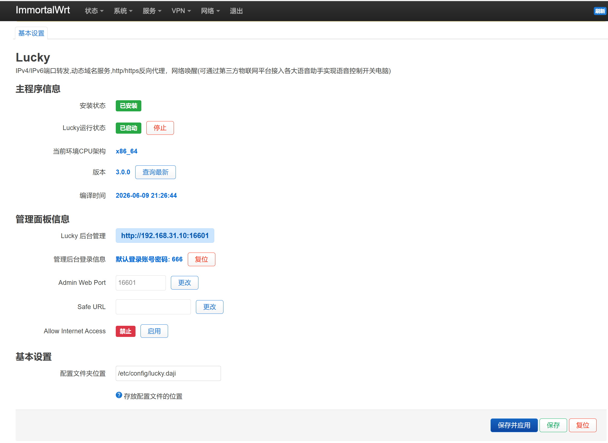

# luci-app-lucky (APK Build)

[](https://github.com/FloatingDream528/luci-app-lucky/actions/workflows/build-apk.yml)
[](https://github.com/FloatingDream528/luci-app-lucky/releases)
[](https://opensource.org/licenses/GPL-3.0)

这是 [Lucky](https://github.com/gdy666/lucky) 的 OpenWrt LuCI 控制面板以及 Lucky 预编译核心的打包源码库。专门针对采用全新 `apk` 包管理器的 OpenWrt 系统环境设计。

本仓库实现了**完全自动化**：
- 🤖 **每日追更**：每天自动巡查 [Lucky 官方发布站](https://release.66666.host/)，一旦有新版本立即自动构建并发版。
- 📦 **开箱即用**：所有发布的 `.apk` 包已**内置了预编译的核心文件** (`/usr/bin/lucky`)。在路由器上安装或启动服务时**无需再次进行在线下载核心**的操作，告别网络不佳导致的服务启动失败。
- 🛠 **全架构支持**：得益于 GitHub Actions 矩阵编译，原生支持主流的各种路由器架构环境。

> ⚠️ **注意**：这里的 APK 指的是 Alpine/OpenWrt 新版包管理器使用的 `.apk` 包格式，**不是 Android 的 APK**！

## 🚀 支持的架构对照表

目前 Release 页面提供以下架构的独立构建（Zip 压缩包内含相应的所有 apk 文件）：

| 构建架构 (Zip 名称) | 说明 / 常见设备代表 |
| :--- | :--- |
| `x86_64` | Intel/AMD 64位软路由 (X86) |
| `aarch64_generic` | ARM 64位软路由/盒子 (如 R2s, 树莓派等 ARMv8 平台) |
| `arm_cortex-a7_neon-vfpv4` | ARMv7 设备 (如 竞斗云, 极路由X, IPQ40xx 系列等) |
| `mips_24kc` | MIPS 大端设备 (如 较老的 Atheros AR 系列, AR9344 等) |
| `mipsel_24kc` | MIPS 小端设备 (如 MTK MT7620, MT7621, 新路由3 等) |
| `i386_pentium4` | 老款 32位 软路由 |

---

## 🛠 安装指南 (极其重要)

### 为什么不能在网页上直接上传安装？
不要使用 LuCI 网页后台的“系统 -> 软件包 -> 上传软件包”按钮安装 Release 中的 APK。该入口执行时不会携带 `--allow-untrusted` 参数。由于我们使用 GitHub Actions 自动构建，未加入您本地路由器的受信任签名列表，网页安装会报 `UNTRUSTED signature` 错误并导致安装失败。

### 正确的 SSH 安装步骤：

1. 到 [Releases 页面](https://github.com/FloatingDream528/luci-app-lucky/releases) 下载符合你路由器架构的 `.zip` 压缩包。
2. 解压该 Zip，你会得到对应架构的数个 `.apk` 文件。
3. 通过 WinSCP / MobaXterm 等工具，将解压出的所有 `.apk` 文件上传到路由器的 `/tmp/` 目录下。
4. SSH 登录路由器终端，执行以下命令进行安装：

```sh
cd /tmp
# 必须带上 --allow-untrusted 参数跳过签名验证
apk add --allow-untrusted ./*_lucky-*.apk ./*_luci-app-lucky-*.apk

# 重载网页服务器和后台接口缓存
/etc/init.d/rpcd reload
/etc/init.d/uhttpd reload

# 设置开机自启并启动 Lucky
/etc/init.d/lucky enable
/etc/init.d/lucky restart
```

## 🔄 升级注意

从旧版本或其它第三方 Lucky 分支切换前，**强烈建议先在 Lucky 后台页面备份配置文件**。

如果您遇到了冲突或包损坏，可以尝试先完全卸载旧包：

```sh
# 若您使用的是旧版 OPKG 包管理器
opkg remove lucky luci-i18n-lucky-zh-cn luci-app-lucky

# 若您使用的是新版 APK 包管理器
apk del lucky luci-i18n-lucky-zh-cn luci-app-lucky
```

## 🎨 界面预览

本插件对 LuCI 前端控制页面进行了现代化重构，支持实时状态轮询、配置热更新、自适应浅色/深色主题：




## 致谢

- 核心引擎来自 [gdy666/lucky](https://github.com/gdy666/lucky)
- 原始打包结构参考 OpenWrt 社区生态